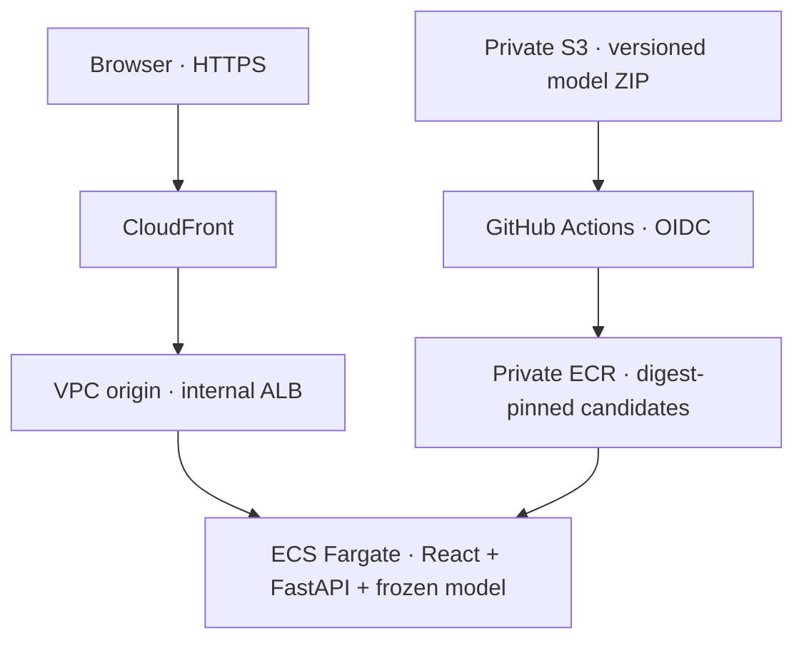

# AWS deployment contract (0.7)

This increment prepares AWS deployment. It does not establish a deployed endpoint. Follow
[UPDATE_07.md](../UPDATE_07.md), record the actual CI/staging/production/drill receipts, and then
mark the corresponding checklist items complete.

## Components and boundaries

The viewer has HTTPS on an AWS CloudFront hostname; no purchased domain is needed. The ALB is
internal in private subnets and receives HTTP through a CloudFront VPC origin. This is not
end-to-end TLS. Tasks have public IPv4 addresses for outbound ECR/log access, but their security
group admits port 8000 only from the ALB group. There is no NAT gateway. Paris (`eu-west-3`) is the
default region. Each environment has a separate VPC, ECS cluster/service, ALB and distribution.

CloudFront disables caching for the whole application, forwards viewer headers except Host,
and has zero error-cache TTL for 500/502/503/504. POST inference is forwarded; model metadata,
readiness and predictions are not served from a cached previous release. Static caching can be
introduced with measured behavior in the operations increment.

Fargate starts one 0.5-vCPU/1-GiB Linux x86_64 task. This is a starting allocation, not a capacity
claim. The container is UID 10001, has a read-only root filesystem, drops capabilities, and uses
an ephemeral `/tmp` volume. The application task role has no AWS permissions. ECR/log permissions
belong to the separate execution role.
The cloud Docker stage explicitly owns this directory as UID 10001 and declares `VOLUME /tmp` so
Fargate can initialize the volume permissions. The publisher exercises an initialized Docker volume
and an explicit non-root write/remove probe before pushing the candidate.
Logs retain seven days; this is not the final monitoring
stack. No sensor inputs are written by the application. Public demo access has no account system;
use artificial inputs for the initial rollout. Public rate limiting/operational limits remain stage 8.

## Immutable model, code and image

`python -m fleetguard.cloud pack` copies only the twelve frozen inference files. It excludes
official-test predictions, sensor records and reports. ZIP member order/timestamps are fixed, so
the same input bytes produce the same SHA256. It preserves the original model/calibration/threshold.
The command loads a **trusted, locally created** model to verify inference; it never trains or reads
official test labels. A checksum is an integrity check, not proof that an arbitrary pickle is safe.

Upload to `models/<sha256>.zip` with `If-None-Match: *`. The bucket is private, encrypted with SSE-S3,
versioned and rejects non-TLS access. The publisher downloads an explicit S3 VersionId, checks the
archive SHA256, rejects unsafe/duplicate/extra/oversized members and verifies freeze hashes before
deserializing the trusted model. Both compressed and uncompressed size are capped at 200 MiB.

The multi-stage Dockerfile builds the frontend from its npm lockfile, installs core + serving
Python dependencies from uv.lock, and accepts the model as a separate named BuildKit context.
The cloud image embeds the model and frontend; the default local image still uses the existing
read-only bundle mount. `compose.yaml` therefore opens the web UI as well as the API.

The cloud publisher builds **once**, runs HTTP/local score parity on that image, checks the built
web root/non-root user/no research imports, then pushes those exact image bytes to private ECR.
Tags include commit/model/run/attempt and cannot be overwritten. Promotion uses `repository@sha256:…`.
The candidate receipt contains the full Git SHA, build run ID, bundle SHA256 and full model identity.
`/v1/deployment` exposes only these non-secret code/model/image identifiers. Local unknown values are
explicit `null`; ECS supplies the deployed digest. This is declared runtime provenance, not cryptographic
attestation. The image digest provides the actual immutable packaging boundary; base image tags remain
floating at build time and subsequent builds may produce a different digest.

## GitHub trust and gates

Create `cloud-build`, `staging` and `production` environments, restricted to `main`. Record the
actual OIDC `sub` with the provided identity workflow before creating IAM trust. GitHub subject
formats may include immutable owner/repository IDs; do not guess from a repo URL. IAM trusts the exact
environment-specific subject and `sts.amazonaws.com`, without a repository wildcard. One existing
account OIDC provider can be reused. Production reviewer rules should be enabled where supported
by the repository's GitHub plan.

The publisher can read versioned model objects and push only the project ECR repository. Deploy
roles can update only their own named ECS service, inspect their own task-definition family and pass
only their own two ECS roles. `RegisterTaskDefinition` requires resource `*`; deployment helpers
still enforce the account, region, repository, service/family and one-container contract. These
roles do not authorize Terraform provisioning. Initial provisioning uses a separate local identity.

Cloud workflows are manually dispatched from `main` and require successful CI on the dispatch
commit. Receipts are downloaded only from the expected successful main-branch workflow in the
same repository. Production additionally requires a successful **staging** receipt for the exact
image/code/model candidate. Stage approval is not inferred from an ECR tag or a healthy old service.
An older candidate can be selected for manual rollback without rebuilding it. Operations are
serialized per environment, with in-progress cancellation disabled.

GitHub receipts retain 90 days; download them for durable evidence before they expire. ECR has no
automatic candidate deletion policy, so storage grows until deliberately maintained. Keep the images
and receipts needed for rollback; an expired receipt must be revalidated on staging before promotion.

## Failure and rollback

The deploy helper first verifies the existing stable service and its identity, clones its task
definition, changes the image/provenance, registers a revision and updates the service. The waiter
requires the requested revision to be PRIMARY/COMPLETED with the desired running count. An ECS
service that becomes stable on the **previous** revision after circuit-breaker rollback is a failure
of the new deployment.

After rollout, the helper checks health, official model identity, artificial single/batch inference,
deployment provenance, HTML and JS/CSS assets at the public URL. Failure restores the previous task
definition and verifies that previous candidate. The original deployment still exits nonzero and
records rollback success/failure. Failure before mutation does not change the service. These probes
are software contract checks, not performance measurement or an official-test reevaluation.

`rollback-drill` is restricted to staging and the currently served candidate. It creates a new
revision pointing to an intentionally missing model directory. Startup should fail; the helper
requires ECS to report failure/rollback, restores the previous revision, and probes it. A timeout,
registration error or unverifiable restored endpoint does not count as a successful drill. A drill
receipt is `rollback_verified`, not a successful staging promotion receipt.

## Terraform state and later infrastructure changes

`infra/bootstrap` creates the buckets, registry, OIDC roles and monthly **account** budget alert.
Its local backend path is explicitly outside OneDrive/source. Preserve that state and an encrypted
backup. `infra/runtime` uses the private versioned S3 backend with lock files. Separate backend keys,
config files and `TF_DATA_DIR` paths isolate staging/production. Never reuse a staging state key for
production. Do not commit state, plans, credentials or generated tfvars.

After bootstrap, CI owns ECS task-definition revisions; Terraform ignores service task-definition
changes so a network/logging plan does not silently restore an older image. When changing container
runtime settings (memory/environment/mounts/health), apply the infrastructure plan and explicitly
update the service to the newly generated Terraform task definition before running the approved
candidate again. The next deployment clones the **current** service definition.

Plans/apply/destroy require review of their real resource diff. Creating these resources incurs AWS
charges, including idle ALB/Fargate/public IPv4/logs/ECR/S3 and CloudFront traffic. Two live environments
approximately duplicate the per-environment fixed resources. A budget email is an alert, not a
spending cap. Use AWS Pricing Calculator for the chosen region and expected usage; no free-tier or
monthly price is assumed. Destroy an unused runtime environment through its own saved state. Buckets
and ECR reject forced content deletion; keep required models, state history and rollback images.

## Validation and sources

Local evidence is [cloud-07.json](results/cloud-07.json). Python tests cover deterministic archive
roundtrip, altered archives, exact promotion receipts, successful deploy, rollout/probe failure,
failed rollback and staging drills with an AWS fake. Real local HTTP checks use the frozen reference
bundle and built UI. These do not establish an AWS deployment.

Terraform 1.13.5 parses/formats the configuration here. Provider validation and mock-plan execution
are blocked locally because this runtime prohibits the Unix sockets used by provider plugins.
`scripts/check-cloud.ps1` and the CI infrastructure job require both validations and all mock plans
on supported Windows/Linux hosts before merge. Docker is unavailable locally; default and cloud
image builds/runs are required by CI/publisher. A successful CI and actual AWS receipts remain to record.

Primary references checked on 2026-10-08:

- [CloudFront VPC origins](https://docs.aws.amazon.com/AmazonCloudFront/latest/DeveloperGuide/private-content-vpc-origins.html)
- [Terraform CloudFront VPC origin](https://registry.terraform.io/providers/hashicorp/aws/latest/docs/resources/cloudfront_vpc_origin)
- [GitHub OIDC in AWS](https://docs.github.com/en/actions/how-tos/secure-your-work/security-harden-deployments/oidc-in-aws)
- [ECS circuit breaker](https://docs.aws.amazon.com/AmazonECS/latest/developerguide/deployment-circuit-breaker.html)
- [ECS bind-volume ownership](https://docs.aws.amazon.com/AmazonECS/latest/developerguide/bind-mounts.html)
- [AWS CLI temporary sign-in](https://docs.aws.amazon.com/cli/latest/userguide/cli-configure-sign-in.html)
- [Fargate pricing](https://aws.amazon.com/fargate/pricing/) and [AWS Pricing Calculator](https://calculator.aws/)
