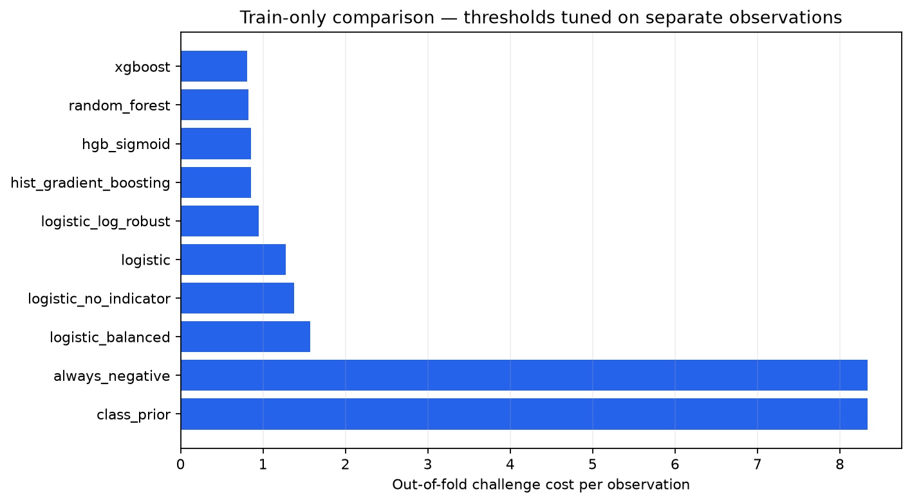
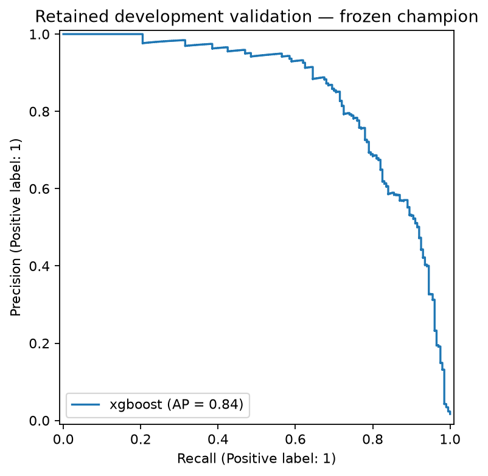
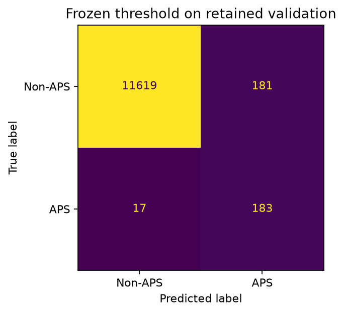
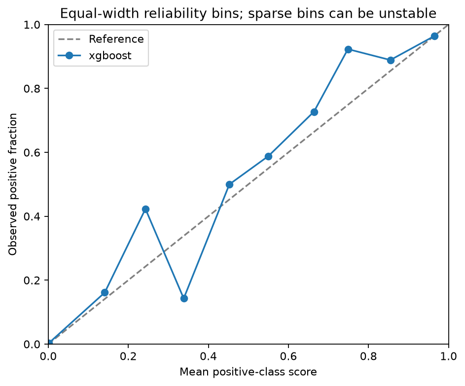

# FleetGuard — train-only comparison

Run: `20261007T143440Z-be878e90`.

Candidates are compared using scoring folds inside the development partition.
Fitting, calibration and threshold-tuning roles are disjoint within every fold.

| Candidate | OOF cost | Cost/row | Mean AP | Mean recall | Fold cost/row SD |
|---|---:|---:|---:|---:|---:|
| xgboost | 38740 | 0.8071 | 0.8441 | 0.9525 | 0.1188 |
| random_forest | 39650 | 0.8260 | 0.6927 | 0.9575 | 0.1546 |
| hgb_sigmoid | 41000 | 0.8542 | 0.8366 | 0.9437 | 0.0638 |
| hist_gradient_boosting | 41000 | 0.8542 | 0.8366 | 0.9437 | 0.0638 |
| logistic_log_robust | 45430 | 0.9465 | 0.8059 | 0.9325 | 0.0478 |
| logistic | 61240 | 1.2758 | 0.7164 | 0.8938 | 0.1139 |
| logistic_no_indicator | 66130 | 1.3777 | 0.7062 | 0.8875 | 0.0647 |
| logistic_balanced | 75500 | 1.5729 | 0.6891 | 0.8475 | 0.1983 |
| always_negative | 400000 | 8.3333 | 0.0167 | 0.0000 | 0.0180 |
| class_prior | 400000 | 8.3333 | 0.0167 | 0.0000 | 0.0180 |

## Frozen champion

Selected by development CV: `xgboost`.
Fitting/reserved-calibration/threshold rows: 28800/9600/9600.
Retained validation rows: 12000; threshold: 0.03765915.

Cost: **10310**; FP: **181**; FN: **17**; recall: **0.9150**; precision: **0.5027**.

## Errors by missingness

| Missing fraction | Observations | Positives | FP | FN | Cost/row |
|---|---:|---:|---:|---:|---:|
| 0%–5% | 6201 | 65 | 37 | 10 | 0.8660 |
| 5%–20% | 5072 | 72 | 85 | 5 | 0.6605 |
| 20%–50% | 643 | 63 | 55 | 2 | 2.4106 |
| 50%–100% | 84 | 0 | 4 | 0 | 0.4762 |

## Limits

Fold standard deviations describe variation across correlated CV folds.
They are not confidence intervals.
Validation was inspected during increment 1; it is not a new blind test.
Only the CV-selected champion is scored there. No official test is evaluated.
Increment-1 models had different fitting sample sizes.
Direct comparison of their scores with this protocol is inappropriate.
Sigmoid calibration uses a separate role; its quality must still be measured.

## Reproduction and evidence

Run `uv run --frozen --extra dev fleetguard compare` from the repository root.

Full aggregate metrics, source hashes, environment and role hashes are recorded in
[comparison-02.json](comparison-02.json). Candidate and fold tables are in
[comparison-02.csv](comparison-02.csv) and [comparison-02-folds.csv](comparison-02-folds.csv).

The CPU run uses the committed comparison config. Per-observation predictions, fitted
models and role manifests are regenerated locally and remain excluded from Git.
