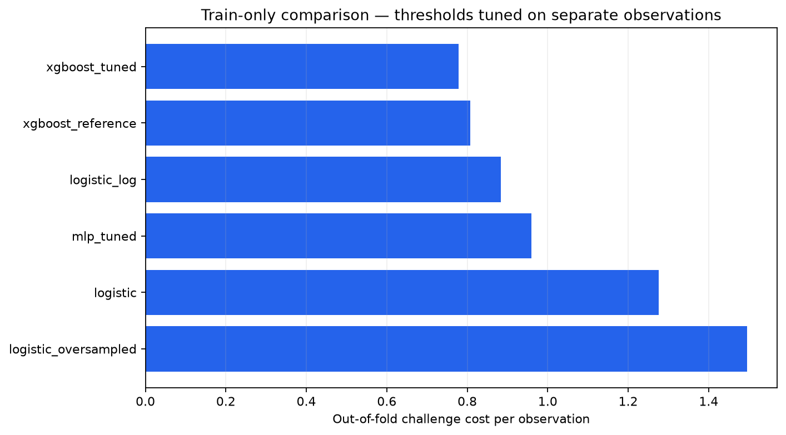
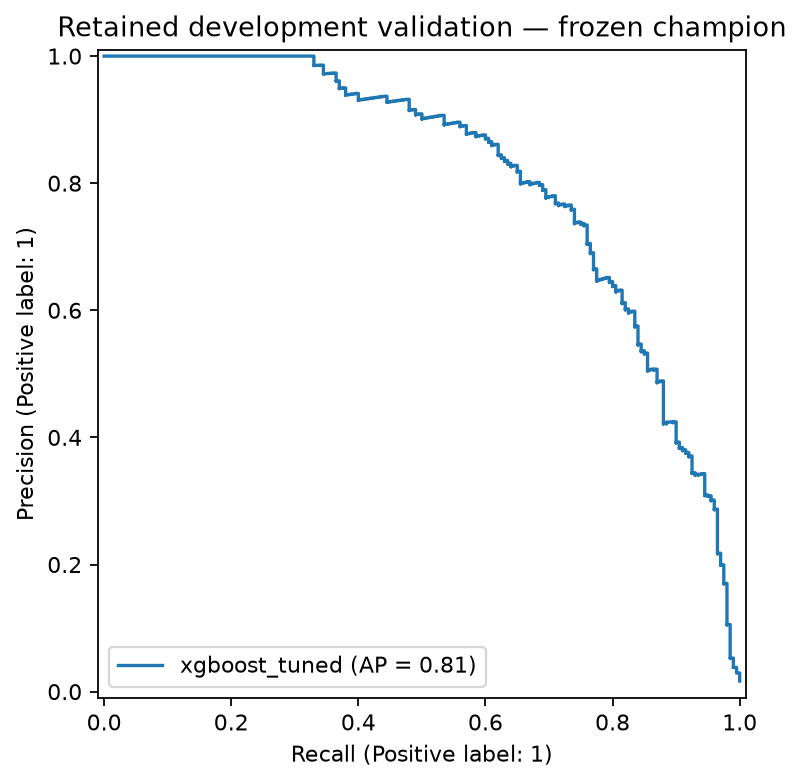
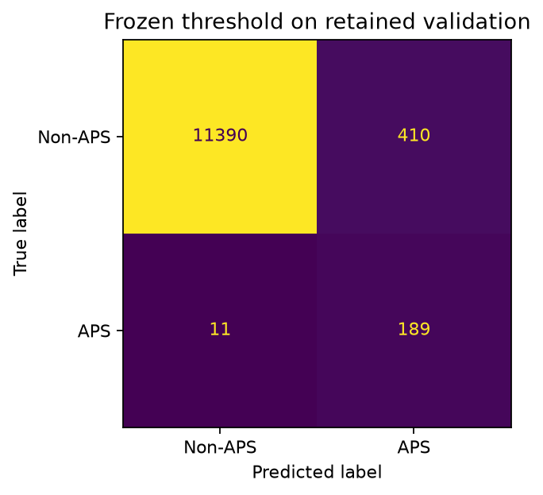
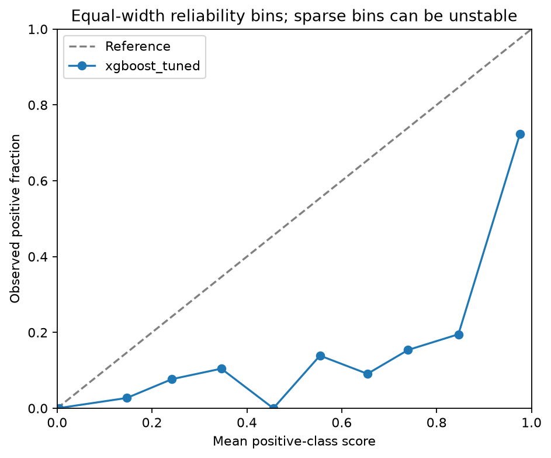
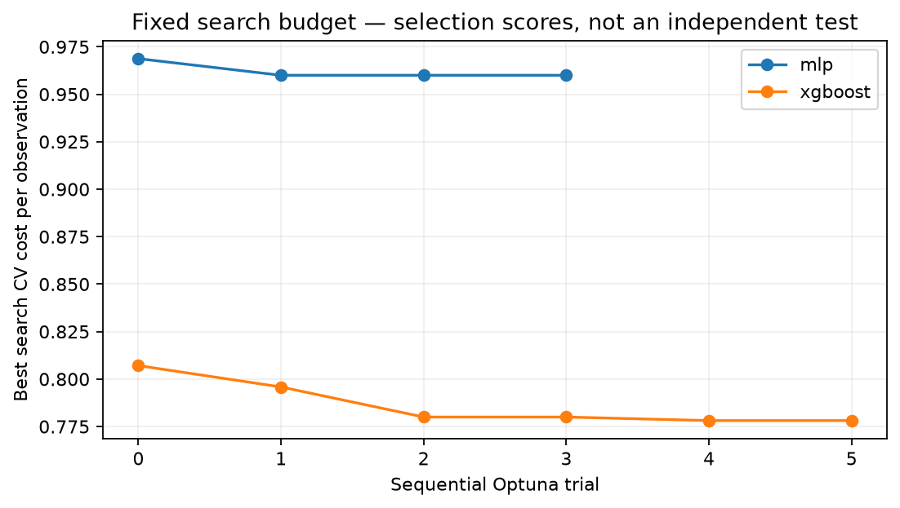
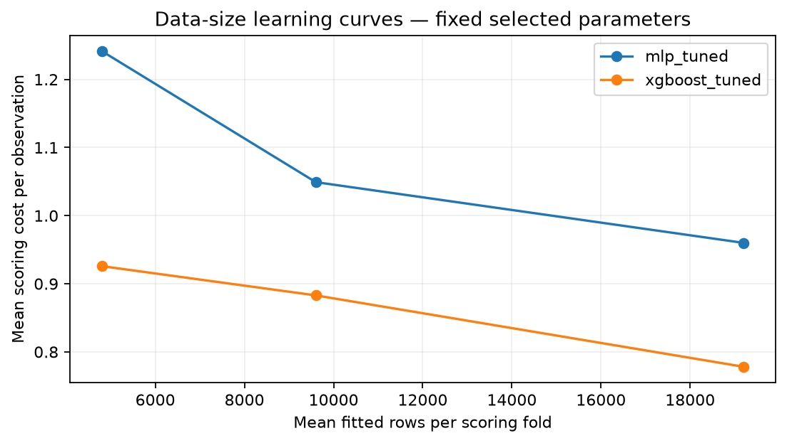
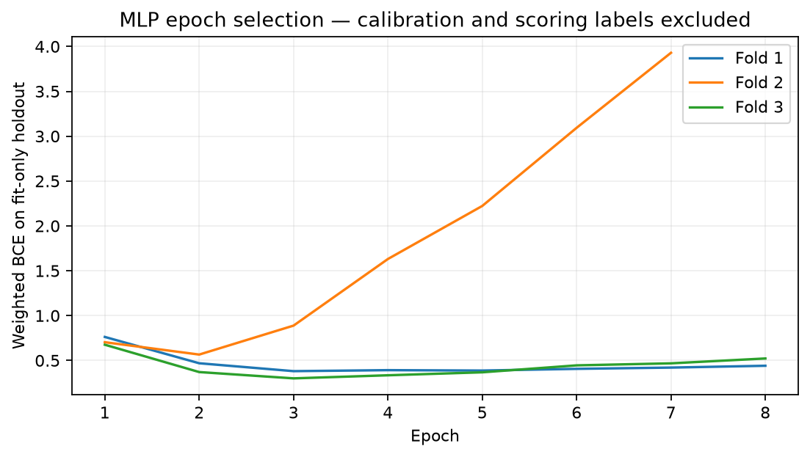

# FleetGuard — budgeted optimization

Run: `20261007T184315Z-a4e5b402`.

Candidates are compared using scoring folds inside the development partition.
Fitting, calibration and threshold-tuning roles are disjoint within every fold.

| Candidate | OOF cost | Cost/row | Mean AP | Mean recall | Fold cost/row SD |
|---|---:|---:|---:|---:|---:|
| xgboost_tuned | 37350 | 0.7781 | 0.8132 | 0.9500 | 0.1176 |
| xgboost_reference | 38740 | 0.8071 | 0.8441 | 0.9525 | 0.1188 |
| logistic_log | 42380 | 0.8829 | 0.8042 | 0.9513 | 0.1008 |
| mlp_tuned | 46080 | 0.9600 | 0.6185 | 0.9238 | 0.2098 |
| logistic | 61240 | 1.2758 | 0.7164 | 0.8938 | 0.1139 |
| logistic_oversampled | 71780 | 1.4954 | 0.7003 | 0.8500 | 0.1457 |



## Frozen champion

Selected by development CV: `xgboost_tuned`.
Fitting/reserved-calibration/threshold rows: 28800/9600/9600.
Retained validation rows: 12000; threshold: 0.17682585.

Cost: **9600**; FP: **410**; FN: **11**; recall: **0.9450**; precision: **0.3155**.







## Errors by missingness

| Missing fraction | Observations | Positives | FP | FN | Cost/row |
|---|---:|---:|---:|---:|---:|
| 0%–5% | 6201 | 65 | 110 | 8 | 0.8224 |
| 5%–20% | 5072 | 72 | 170 | 3 | 0.6309 |
| 20%–50% | 643 | 63 | 106 | 0 | 1.6485 |
| 50%–100% | 84 | 0 | 24 | 0 | 2.8571 |

## Limits

Fold standard deviations describe variation across correlated CV folds.
They are not confidence intervals.
Validation was inspected during increment 1; it is not a new blind test.
Only the CV-selected champion is scored there. No official test is evaluated.
Increment-1 models had different fitting sample sizes.
Direct comparison of their scores with this protocol is inappropriate.
Sigmoid calibration uses a separate role; its quality must still be measured.

## Search protocol and limitations

Optuna trials reuse the development scoring folds. These CV scores are selection scores
and can be optimistic after search. These are not nested-CV or final-test estimates.
The candidate is frozen before diagnostics and retained-validation scoring.
Stability changes group split seeds with model seed fixed; it does not retune parameters.
Data-size curves vary fit rows only. Calibration, threshold and scoring roles stay fixed.
MLP epochs use a group-aware holdout inside fit; then all fit rows are refitted.
Sigmoid calibration subsequently uses the separate calibration role.
Oversampling is fitted inside the fit-only pipeline. Other roles keep class frequencies.







## Partition-seed stability

| Candidate | CV seed | Cost/row | Mean AP | FP | FN |
|---|---:|---:|---:|---:|---:|
| xgboost_tuned | 43 | 0.7781 | 0.8132 | 1735 | 40 |
| xgboost_tuned | 44 | 0.7719 | 0.8160 | 1255 | 49 |
| xgboost_tuned | 45 | 0.7492 | 0.8156 | 1796 | 36 |
| mlp_tuned | 43 | 0.9600 | 0.6185 | 1558 | 61 |
| mlp_tuned | 44 | 0.9983 | 0.6549 | 2142 | 53 |
| mlp_tuned | 45 | 0.8796 | 0.5870 | 2072 | 43 |

## Control status

Only controls converged on every scoring fold enter the leaderboard.

| Control | Status | Iteration budget |
|---|---|---:|
| xgboost_reference | complete |  |
| logistic | complete | 100.0 |
| logistic_robust | failed_convergence | 100.0 |
| logistic_log | complete | 100.0 |
| logistic_oversampled | complete | 100.0 |

## Lecture des résultats

Le budget complet 6 XGBoost + 4 MLP a été exécuté sur Scania, avec trois folds pour chaque essai.
XGBoost équilibré, trial 4, est retenu sur le coût CV : **37 350** contre **38 740** pour la référence
fixe de l'update 02 sur les mêmes rôles. Ce gain de sélection de 3,59 % ne supprime pas le biais de
recherche : les folds ont servi à choisir les paramètres.

Sur la validation conservée, avec le seuil final figé à **0,1768258512**, le champion produit
**410 FP et 11 FN**, soit un coût de **9 600**, un rappel de **94,5 %** et une précision de **31,55 %**.
La référence publiée auparavant avait 181 FP et 17 FN, coût 10 310 : le coût baisse ici de 710 unités,
mais le nombre d'alertes augmente nettement. L'AP de validation passe de 0,8447 à 0,8136 et le
Brier de 0,00560 à 0,01391. Il n'y a donc pas de gain uniforme sur toutes les métriques.
Ces scores pondérés ne sont pas présentés comme des probabilités calibrées. Le choix opérationnel
et la calibration seront examinés dans le prochain incrément, avant le gel final.

Le meilleur MLP de ce petit budget atteint un coût CV de **46 080**, AP moyenne **0,6185**.
Il reste derrière XGBoost sur les trois seeds de partition étudiées. Cela décrit ce pipeline et
ce budget, pas une limite universelle des réseaux sur les données tabulaires.

Les deux courbes par taille montrent une baisse du coût en augmentant le rôle fit. Le logarithme
signé seul améliore la logistique dans ce protocole ; l'oversampling par duplication la dégrade.
Le contrôle RobustScaler seul n'a pas convergé dans le budget commun de 100 itérations : il est
explicitement exclu et aucun score partiel ou artefact de ce contrôle n'est publié.

La validation conservée a déjà été observée. **Aucun test officiel n'a été évalué.** Le coût utilise
les unités du challenge, pas des euros. Les trois seeds/folds ne sont pas des intervalles de confiance.

## Reproduction et vérification

```bash
uv sync --frozen --extra dev --extra research
uv run --no-sync python -m fleetguard optimize
```

Sur Windows, utiliser d'abord le script de l'update 03, avec environnement/cache hors OneDrive
et mode copie. Le run de référence utilise Python 3.12 et `uv.lock` ; le JSON associé conserve
versions, paramètres, sources et hashes. D'autres systèmes ou versions peuvent donner de petits écarts.

Les 63 tests passent en Python 3.11 et 3.12. Les trois smokes passent depuis le wheel installé
hors de `src`. Le serveur MLflow local a répondu HTTP 200 sur `/health` et `/`, télémétrie désactivée.
Les scripts PowerShell seront exécutés sur ton PC et dans le nouveau job Windows de CI ;
aucune réussite distante de cette nouvelle CI n'est revendiquée ici.

Fichiers agrégés : [table](optimization-03.csv), [essais](optimization-03-trials.csv),
[folds](optimization-03-folds.csv), [seeds](optimization-03-stability.csv),
[tailles](optimization-03-learning-curves.csv), [epochs MLP](optimization-03-mlp-epochs.csv),
[statut des contrôles](optimization-03-controls.csv), [provenance](optimization-03.json).
